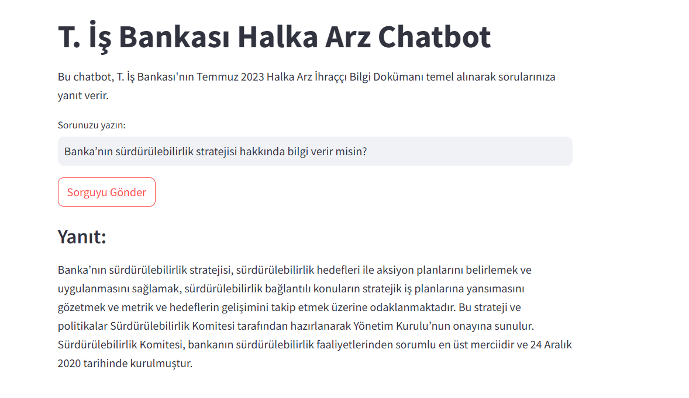
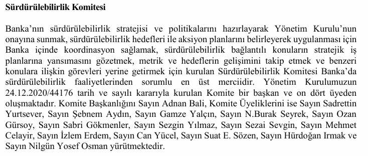

# RAG Chatbot

PDF belgelerini işlemek ve analiz etmek için tasarlanmış akıllı bir soru-cevaplama sistemidir. FastAPI, Azure OpenAI, Milvus ve SQLAlchemy kullanılarak geliştirilmiştir. Kullanıcıların **T. İş Bankası Temmuz 2023 Halka Arzı - İhraççı Bilgi Dokümanı** üzerinden sorular sormasına olanak tanır ve belgelerden bağlama duyarlı, doğru yanıtlar sağlar.


## Demo

Proje demosunu izlemek için [YouTube](https://www.youtube.com/watch?v=4-o1sY0wQM0).


## PDF Belgesi
İnternetten bulduğum örnek pdf:

https://www.isyatirim.com.tr/tr-tr/hizmetler/kurumsal-finansman/duyurular/Documents/T.%20%C4%B0%C5%9F%20Bankas%C4%B1%20Temmuz%202023%20Halka%20Arz%C4%B1%20-%20%C4%B0hra%C3%A7%C3%A7%C4%B1%20Bilgi%20Dok%C3%BCman%C4%B1.pdf


## Genel Bakış

Bu proje, önceden tanımlanmış PDF dosyalarını işleyen, vektör veri tabanına indeksleyen ve kullanıcıların içerikle ilgili sorular sormasına olanak tanıyan bir Retrieval-Augmented Generation (RAG) chatbotudur.

**Şekil 1:** Streamlit Arayüzü



**Şekil 2:** PDF Belgesindeki İlgili Bölüm




### Temel Teknolojiler

1. **FastAPI**: API istekleri için yüksek performanslı bir backend sağlar.
2. **Azure OpenAI**: Embedding oluşturma ve doğal dil yanıtları için GPT modellerini kullanır.
3. **Milvus**: Benzerlik tabanlı aramalar için vektör veri tabanı.
4. **SQLAlchemy ve Alembic**: Yapılandırılmış veritabanı etkileşimleri ve geçişleri yönetir.
5. **Microsoft SQL Server**: Kullanıcı sorgularını, yanıtlarını ve performans metriklerini kaydeder.
6. **Streamlit**: Chatbot ile etkileşimli bir kullanıcı arayüzü sunar.

---

## Özellikler

1. **Önceden İndekslenmiş PDF**: Önceden tanımlı bir PDF üzerinden sorgu yanıtlar.
2. **Bağlam Duyarlı Soru-Cevaplama**: GPT ile belge embedding'lerini birleştirerek alakalı yanıtlar sağlar.
3. **Ölçeklenebilir Altyapı**: Milvus ile yüksek hızlı vektör benzerlik aramaları yapılır.
4. **Kapsamlı Kayıt Tutma**: MSSQL kullanarak kullanıcı sorgularını ve performans metriklerini takip eder.
5. **Streamlit Arayüzü**: Kullanıcı dostu bir etkileşim platformu sağlar.

---

## Kullanım Senaryoları

**Kurumsal Araştırmalar**

- Örnek: "Banka’nın sürdürülebilirlik stratejisi hakkında bilgi verir misin?"
- Örnek: "TSKB çevresel yönetim sistemi hakkında bilgi verir misin?"
- Örnek: "Sözleşme ihlalleri için belirtilen cezalar nelerdir?"

---

## Şema

1. **PDF**: Sistem, statik bir PDF dosyasını  kullanır, bu dosya önceden işlenir ve indekslenir.
2. **Embedding**: Belgeler daha küçük parçalara bölünür ve Azure OpenAI kullanılarak vektör embedding'lerine dönüştürülür.
3. **Vektör Database**: Embedding'ler, benzerlik tabanlı sorgular için Milvus'ta saklanır.
4. **Sorgu İşleme**: Kullanıcı sorguları işlenir, vektörleştirilir ve saklanan embedding'lerle eşleştirilir.
5. **Yanıt Oluşturma**: İlgili belge bölümleri alınır ve bağlam duyarlı yanıt oluşturmak için GPT'ye iletilir.
6. **Kayıt Tutma**: MSSQL kullanılarak kullanıcı etkileşimleri kaydedilir ve denetlenir.

### Mimari Diyagram

```
+----------------+       +------------------+       +----------------+       +-----------------+
| Kullanıcı Sorgusu| ----> | FastAPI Backend  | ----> | Milvus Vektör   | ----> | Azure OpenAI     |
| (Streamlit UI) |       | (Sorgu İşleme)   |       | (Veri Getirme)  |       | (Yanıt Oluşturma)|
+----------------+       +------------------+       +----------------+       +-----------------+
                     |                                                     |
                     v                                                     v
               +-------------+                                     +---------------+
               |   MSSQL     | <---------------------------------> |   Kayıt Tutma  |
               +-------------+                                     +---------------+
```

---

## Proje Yapısı

```
chatbot_project/
├── app/
│   ├── configs/
│   │   ├── config.py         # Uygulama yapılandırması
│   │   ├── database.py       # Veritabanı bağlantı mantığı
│   │   ├── embedEtcd.yaml    # Ek yapılandırma dosyaları
│   │   ├── user.yaml         # Kullanıcı yapılandırmaları
│   ├── doc/
│   │   └── banka.pdf         # İşlenen PDF dosyası
│   ├── logger/               # Loglama işlemleri
│   │   ├── logging.py        # Loglama işlevselliği
│   │   ├── logging_utils.py  # Loglama yardımcı işlevleri
│   ├── routers/
│   │   ├── __init__.py
│   │   ├── search.py         # API arama rotası
│   ├── schemas/
│   │   ├── contextualize_q_prompt.jinja2
│   │   ├── qa_system_prompt.jinja2
│   ├── services/
│   │   ├── chains.py         # Zincirleme sorgu mantığı
│   │   ├── middleware.py     # Middleware işlemleri
│   │   ├── vectorstore.py    # Vektör depolama mantığı
├── scripts/
│   └── standalone_embed.bat  # Milvus başlatma betiği
├── static/img                # Statik dosyalar (img)
├── .env                      # Ortam değişkenleri
├── alembic.ini               # Alembic yapılandırması
├── app.py                    # Streamlit arayüzü
├── main.py                   # FastAPI giriş noktası
├── README.md                 # Proje tanıtımı
├── requirements.txt          # Python bağımlılıkları
├── wsgi.py                   # WSGI dağıtım ayarları
```

---

## Kurulum ve Yükleme

### Ön Koşullar

- **Python 3.9+**
- **Docker ve Docker Compose**
- **Microsoft SQL Server**
- **Milvus Standalone**

### Kurulum ve Yapılandırma

1. **Depoyu Klonlayın**
   ```bash
   git clone https://github.com/handeakturk/RAGChatbot.git
   cd chatbot_project
   ```

2. **Python Sanal Ortamı Oluşturun**
   ```bash
   python -m venv venv
   Windows: venv/Scripts/activate
   ```

3. **Bağımlılıkları Yükleyin**
   ```bash
   pip install -r requirements.txt
   ```
4.**Veritabanı Yapılandırması**

Veritabanı bağlantı ayarlarını `configs/database.py` dosyasında yapılandırın.

`database.py` dosyasındaki örnek yapılandırma:

```from sqlalchemy import create_engine, Column, String, Integer, Float, DateTime
from sqlalchemy.orm import declarative_base, sessionmaker
from sqlalchemy.engine import URL
from datetime import datetime
from dotenv import load_dotenv
import os

# .env dosyasını yükle
load_dotenv()

# Çevresel değişkenlerden veritabanı bağlantı bilgilerini al
DRIVER = os.getenv("DB_DRIVER")
SERVER = os.getenv("DB_SERVER")
DATABASE = os.getenv("DB_DATABASE")
TRUSTED_CONNECTION = os.getenv("DB_TRUSTED_CONNECTION")

# MSSQL bağlantısı için connection string oluştur
connection_string = (
    f"Driver={{{DRIVER}}};"
    f"Server={SERVER};"
    f"Database={DATABASE};"
    f"Trusted_Connection={TRUSTED_CONNECTION};"
)

connection_url = URL.create(
    "mssql+pyodbc",
    query={"odbc_connect": connection_string}
)
engine = create_engine(connection_url)

Base = declarative_base()

# Logs tablosu modeli
class Log(Base):
    __tablename__ = 'logs'

    id = Column(Integer, primary_key=True, autoincrement=True)
    request = Column(String, nullable=False)
    response = Column(String, nullable=False)
    duration = Column(Float, nullable=False)
    log_level = Column(String, nullable=False)
    created_at = Column(DateTime, default=datetime.utcnow)
    query_data = Column(String, nullable=True)
    alembic = Column(Integer, nullable=True)

# Tabloyu oluştur
Base.metadata.create_all(engine)

# Session oluştur
Session = sessionmaker(bind=engine)
session = Session()
```

5. **Milvus'u Başlatın**
   https://milvus.io/docs/install_standalone-windows.md dökümanını takip ederek milvus standalone_embed.bat dosyasını indirin.
   ```bash
   standalone_embed.bat start
   ```

6. **Veritabanı Geçişlerini Uygulayın**
   Alembic geçişlerini başlatın ve uygulayın:
   ```bash
   alembic init migrations
   alembic revision --autogenerate -m "Initial migration"
   alembic upgrade head
   ```

7. **FastAPI Sunucusunu Başlatın**
   ```bash
   python main.py
   ```

8. **Streamlit Arayüzünü Başlatın**
   ```bash
   streamlit run app.py
   ```
---

## Nasıl Kullanılır

1. **Belgeye Erişim**: Sistem, İş Bankası Halka Arzı PDF'ini otomatik olarak kullanır.
2. **Soru Sorun**: 
   - Örnek: "TSKB çevresel yönetim sistemi hakkında detaylı ve uzun bilgi verir misin?"
3. **Yanıt Alın**: Belgeye dayalı bağlam duyarlı yanıtlar alın.
4. **Kayıtları Takip Edin**: Kullanıcı sorgularını ve yanıtlarını MSSQL üzerinden izleyin.

---

## Sorun Giderme

### Yaygın Sorunlar

- **Milvus Bağlantı Hatası**: `standalone.bat`'in çalıştığından ve `http://localhost:19530` üzerinden erişilebilir olduğundan emin olun.
- **Veritabanı Hataları**: `.env` dosyasının doğru yapılandırıldığından ve veritabanı sunucusunun çalıştığından emin olun.
- **Dosya Yolu Hataları**: `.env` dosyasındaki `FILEPATH` değişkeninin İş Bankası PDF'ini doğru gösterdiğinden emin olun.

---

## .env Dosyası İçeriği

`.env` dosyasını aşağıdaki şekilde oluşturup doldurun:

```env
DB_DRIVER: Kullanılan ODBC sürücüsünü belirtir.
DB_SERVER: Veritabanı sunucusunun adresini belirtir (localhost, IP veya sunucu adı).
DB_DATABASE: Bağlanılacak veritabanının adını belirtir.
DB_TRUSTED_CONNECTION: Güvenli bağlantı kullanılıp kullanılmayacağını belirtir (Yes veya No).

AZURE_OPENAI_ENDPOINT=<Azure OpenAI endpoint URL>
AZURE_MODEL_NAME=<Kullanılan model adı>
AZURE_DEPLOYMENT_NAME=<Azure'deki dağıtım adı>
AZURE_OPENAI_API_VERSION=<API versiyonu örn: "2023-03-15">
AZURE_OPENAI_API_KEY=<Azure API anahtarınız>
```

Değerleri, Azure OpenAI hesabınızdan alabilirsiniz. Bu bilgiler API ile doğru iletişim kurmak için gereklidir.

---

### Örnek Girdi ve Çıktı

**Search Endpoint'i Kullanımı:**
Postman uygulamasında yeni bir POST request oluşturarak http://127.0.0.1:8000/search/ adresinden json formatında aşağıdaki gibi sorgu yapabilirsiniz.

İstek:
```json
{
    "query": "İş Bankası belgesinde belirtilen risk faktörleri nelerdir?"
}
```

Yanıt:
```json
{
    "query": "İş Bankası belgesinde belirtilen risk faktörleri nelerdir?",
    "answer": "İş Bankası Temmuz 2023 belgesinde aşağıdaki risk faktörleri belirtilmiştir: ..."
}
```

**Streamlit Arayüzü Kullanımı:**

Arayüzde sorunuzu girerek hızlı bir şekilde yanıt alabilirsiniz. Örnek soru:
- "Belgede belirtilen anahtar stratejiler nelerdir?"
---


# Lisans

Bu proje MIT Lisansı ile lisanslanmıştır. Daha fazla bilgi için `LICENSE` dosyasına bakın.

---

## Katkıda Bulunma

Katkıda bulunmaktan memnuniyet duyarız! Şu adımları izleyin:

1. Depoyu çatallayın.
2. Yeni bir dal oluşturun:
   ```bash
   git checkout -b feature/your-feature-name
   ```
3. Değişikliklerinizi işleyin:
   ```bash
   git commit -m "Add your feature description"
   ```
4. Dalınızı iterek gönderin:
   ```bash
   git push origin feature/your-feature-name
   ```
5. İnceleme için bir pull request oluşturun.

---

